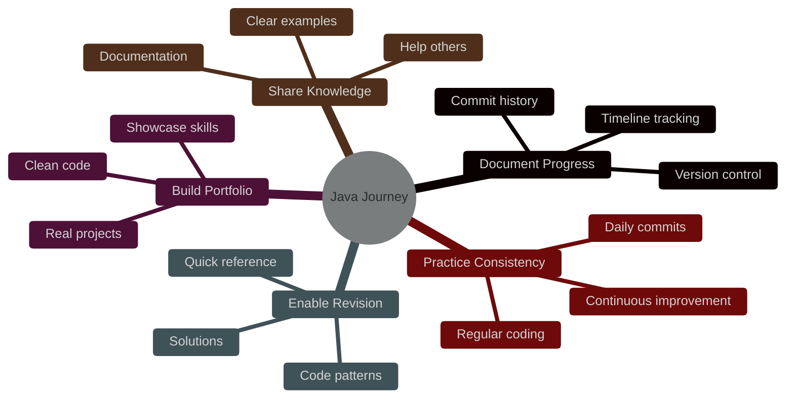
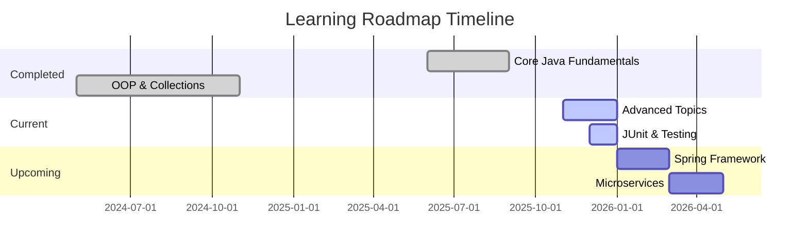

<div align="center">

# ☕ Java Learning Journey


**A comprehensive documentation of my journey from Java fundamentals to advanced concepts**

*Every line of code represents a step forward in mastering one of the most powerful programming languages*

---

[](#-whats-inside)
[](#-featured-projects)
[](#-roadmap)

</div>

---

## 📚 What's Inside

<table>
<tr>
<td width="33%" align="center">

### 🎯 Core Concepts
**Building Strong Foundations**


Classes & Objects • Inheritance  
Polymorphism • Abstraction  
Encapsulation • Methods  
Loops & Conditionals

</td>
<td width="33%" align="center">

### 📊 Data Structures
**Efficient Data Management**


ArrayList • LinkedList  
HashMap • HashSet  
Aggregation • Streams API  
Filter • Map • Reduce

</td>
<td width="33%" align="center">

### 🚀 Advanced Topics
**Mastering Modern Java**


File I/O • Lambda Expressions  
Networking • Multithreading  
Record Classes • Sockets  
RandomAccessFile

</td>
</tr>
</table>

---

## 🎯 Repository Goals

<div align="center">




</div>

| Goal | Description | Status |
|:----:|-------------|:------:|
| 📈 **Document Progress** | Complete timeline of learning journey | ✅ Active |
| 💼 **Build Portfolio** | Showcase practical coding skills | ✅ Growing |
| 📝 **Enable Revision** | Quick reference for concepts & patterns | ✅ Ongoing |
| 🤝 **Share Knowledge** | Help others with clear examples | ✅ Public |
| 🔄 **Practice Consistency** | Regular coding & continuous improvement | ✅ Daily |

---

## 💡 Key Learnings

<div align="center">

### 🎓 Skills Acquired Through This Journey

</div>

<table>
<tr>
<td width="50%">

#### 📐 **Software Engineering**
- ✅ Writing clean, maintainable code
- ✅ Object-oriented design principles
- ✅ Following Java best practices
- ✅ Proper naming conventions
- ✅ Code documentation standards

#### 🔧 **Technical Skills**
- ✅ Data structures internals
- ✅ Algorithm implementation
- ✅ Collections Framework mastery
- ✅ File operations & persistence
- ✅ Network programming basics

</td>
<td width="50%">

#### 🧠 **Problem Solving**
- ✅ Breaking down complex problems
- ✅ Debugging complex issues
- ✅ Code optimization techniques
- ✅ Performance considerations
- ✅ Memory management

#### 🌟 **Modern Java**
- ✅ Functional programming paradigms
- ✅ Lambda expressions & streams
- ✅ Modern Java features (Java 21)
- ✅ Immutable data with records
- ✅ Concurrent programming patterns

</td>
</tr>
</table>

---

## 🚀 Featured Projects

<div align="center">

### 🏆 Real-World Applications Built From Scratch

</div>

<table>
<tr>
<td width="50%">

### 🛒 Supermarket Inventory System
**Technologies:** `ArrayList` `HashMap` `CRUD Operations`

Two complete implementations showcasing different data structures:
- ArrayList-based product management
- HashMap-based inventory tracking
- Full CRUD operations
- Real-world business logic

**Concepts:** Collections, Data Management, OOP Design

---

### 👥 Friend Suggestion Engine
**Technologies:** `HashSet` `Algorithms` `Social Networks`

Intelligent recommendation system that:
- Suggests mutual connections
- Finds common friends
- Optimizes search with HashSet
- Implements graph-like relationships

**Concepts:** Sets, Algorithms, Graph Theory

---

### 🎵 Audio Player
**Technologies:** `Event Handlers` `CLI` `Functional Programming`

Simple yet functional CLI audio player featuring:
- Event-driven architecture
- Audio playback controls
- Clean command-line interface
- Modular design patterns

**Concepts:** Events, Functional Design, User Input

</td>
<td width="50%">

### 🎓 CRUD Student System
**Technologies:** `HashMap` `HashSet` `ArrayList` `Integrated Collections`

Comprehensive student management system:
- Complete CRUD operations
- Multiple collection types
- Data validation
- Search and filter functionality

**Concepts:** Collections Integration, Data Validation

---

### 🍽️ Restaurant Manager
**Technologies:** `Enums` `Threads` `Concurrency`

Advanced restaurant management system:
- Enum-based menu system
- Multi-threaded order processing
- Concurrent task handling
- State management

**Concepts:** Enums, Multithreading, Concurrency

---

### 📚 Library System
**Technologies:** `OOP` `File I/O` `Data Persistence`

Professional library management:
- Book inventory tracking
- Member management
- Borrow/return system
- File-based data storage

**Concepts:** File I/O, OOP Architecture, Persistence

</td>
</tr>
</table>

<div align="center">

**✨ Plus dozens more exercises and mini-applications across all topics!**

</div>

---

## 🛠️ Technology Stack

<div align="center">


</div>

| Category | Tools & Technologies |
|----------|---------------------|
| **Language** | Java 21 (with modern features like Records, Pattern Matching) |
| **IDEs** | IntelliJ IDEA Ultimate, VS Code with Java Extension Pack |
| **Build Tools** | Maven for dependency management and project structure |
| **Version Control** | Git & GitHub for source control and collaboration |
| **Testing** | JUnit 5 (in progress) |
| **Documentation** | Javadoc, Markdown |

---

## 📖 How to Use This Repository

### 🎯 Quick Start Guide

```bash
# 1. Clone the repository
git clone https://github.com/akash0-real/java.git
cd java

# 2. Navigate to any topic folder
cd OOP
# or
cd collections/aggregation
# or
cd projects

# 3. Compile and run any Java file
javac FileName.java
java FileName

# 4. Explore, learn, and experiment! 🚀
```

### 📂 Repository Structure

```
java/
│
├── 📁 OOP/                          # Object-Oriented Programming concepts
│   ├── Classes & Objects
│   ├── Inheritance examples
│   ├── Polymorphism demos
│   └── Abstraction patterns
│
├── 📁 arrays/                       # Array operations and algorithms
│   ├── Searching algorithms
│   ├── Sorting techniques
│   └── Array manipulations
│
├── 📁 collections/aggregation/      # Collections Framework
│   ├── ArrayList implementations
│   ├── LinkedList examples
│   ├── HashMap usage
│   └── HashSet operations
│
├── 📁 file_io/                      # File Input/Output operations
│   ├── RandomAccessFile
│   ├── Buffer operations
│   └── Data persistence
│
├── 📁 hashmaps/                     # HashMap deep dive
├── 📁 hashsets/                     # HashSet implementations
│
├── 📁 lambda_fn/                    # Lambda Expressions & Functional Programming
│   └── Modern Java syntax
│
├── 📁 loop_and_conditional_problems/ # Logic building exercises
│
├── 📁 methods/                      # Method design patterns
│
├── 📁 networking/                   # Network programming
│   ├── Client-Server apps
│   └── Socket programming
│
├── 📁 projects/                     # Real-world applications
│   ├── Inventory systems
│   ├── Management systems
│   └── Mini applications
│
├── 📁 streamline_api/              # Streams API
│   ├── Filter operations
│   ├── Map & Reduce
│   └── Collectors
│
├── 📁 strings/                      # String manipulation
│
└── 📄 README.md                     # You are here! 👋
```

### 💡 Learning Tips

1. **Start with Fundamentals** → Begin with OOP and basic concepts
2. **Build Projects** → Apply concepts in real applications
3. **Practice Daily** → Consistency is key to mastery
4. **Experiment** → Modify code and see what happens
5. **Document** → Write comments and notes as you learn

---

## 🔮 Roadmap

<div align="center">

### 🎯 What's Coming Next

</div>

<table>
<tr>
<td width="50%">

### 🚧 In Progress

- [ ] **JUnit 5 Testing**  
  Comprehensive unit testing for all projects

- [ ] **Design Patterns**  
  Singleton, Factory, Observer, Strategy, Builder

- [ ] **Data Structures & Algorithms**  
  Complete DSA implementations from scratch

- [ ] **Functional interfaces**  
  Complete implementation on functional database 

</td>
<td width="50%">

### 🔜 Coming Soon

- [ ] **JDBC Integration**  
  Database connectivity and operations

- [ ] **JavaFX Applications**  
  GUI development and desktop apps

- [ ] **Spring Framework**  
  Introduction to Spring Boot & Spring Core

- [ ] **RESTful APIs**  
  Building web services with Java

- [ ] **Microservices**  
  Distributed systems architecture

</td>
</tr>
</table>

<div align="center">



</div>

---

## 🤝 Contributing

<div align="center">

### 💬 Feedback & Suggestions Welcome!

While this is a personal learning repository, I'd love to hear from you!

</div>

| How to Contribute | Description |
|-------------------|-------------|
| 🐛 **Report Bugs** | Found an issue? Open an issue on GitHub |
| 💡 **Suggest Topics** | Have ideas for new projects or concepts? Let me know! |
| 📖 **Share Resources** | Know great Java learning materials? Share them! |
| ⭐ **Star the Repo** | If you find this helpful, give it a star! |
| 🔀 **Fork & Learn** | Feel free to fork and use for your own learning |

---

## 📬 Connect With Me

<div align="center">

**Let's connect and grow together! I'm always excited to meet fellow Java enthusiasts and developers.**

[](https://github.com/akash0-real)
[](https://www.linkedin.com/in/akash-bisht-601268322)
[](mailto:aayush45r@gmail.com)

<br>

**💬 Open for:**
- Collaboration on Java projects
- Code reviews and feedback
- Learning resources exchange
- Career advice and mentorship

</div>

---

## ⭐ Show Your Support

<div align="center">

**If you find this repository helpful, inspiring, or useful:**

### 🌟 Star this repository
### 🔀 Fork it for your own learning journey
### 📢 Share it with others learning Java

<br>

**Every star ⭐ motivates me to keep learning and building!**

---

### 📊 Repository Stats


</div>

---

<div align="center">

## 📜 License

This project is open source and available under the [MIT License](LICENSE)

Feel free to use this code for learning, teaching, or building your own projects!

---

<br>

# **Happy Coding!** ☕💻

<br>

### *"The only way to learn a new programming language is by writing programs in it."*
— **Dennis Ritchie**

<br>

---

**Made with ☕ and 💻 by [Akash Bisht](https://github.com/akash0-real)**

*Last Updated: December 2025*

<br>

[](https://forthebadge.com)
[](https://forthebadge.com)
[](https://forthebadge.com)

</div>